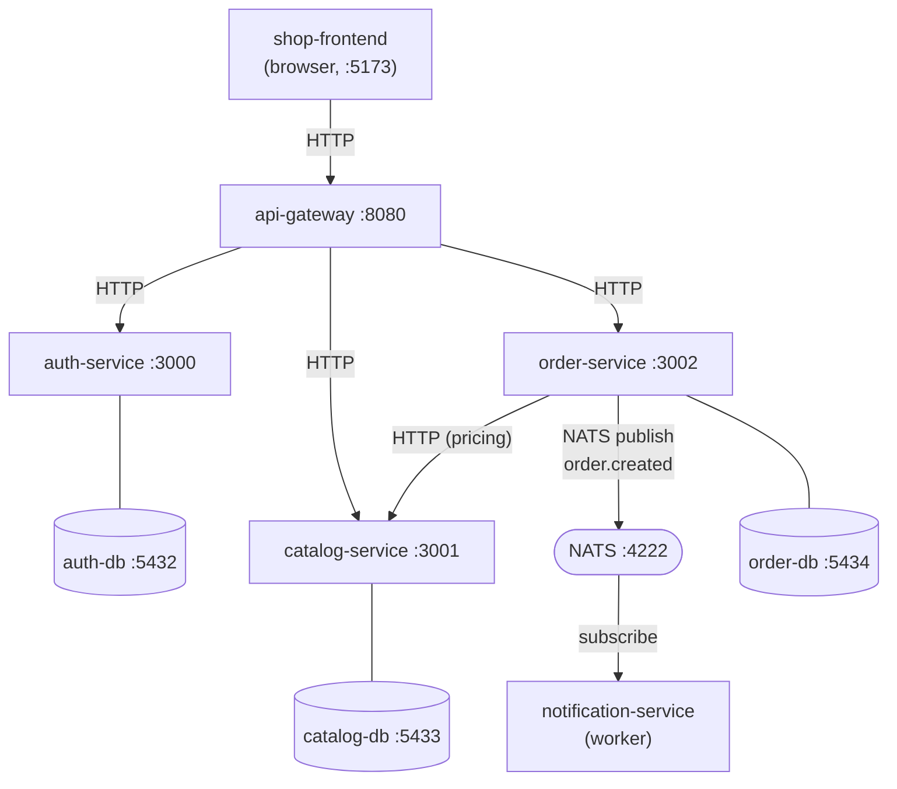

# shop-infra

Central orchestration repository for a microservices-based webshop. It contains the
`docker-compose.yml` that builds and runs the entire system: five services, three
PostgreSQL databases and a NATS message broker on a shared Docker network.

The services themselves live in their own repositories and are built from local
sources by Compose, so all repositories must be cloned side by side (see
[Repository layout](#repository-layout)).

## Overview

| Component | Stack | Role |
| --- | --- | --- |
| [`api-gateway`](https://github.com/adaniel22/api-gateway) | NestJS | Single entry point for the frontend; reverse proxy and JWT validation at the edge |
| [`auth-service`](https://github.com/adaniel22/auth-service) | NestJS | Authentication, user management, JWT access and refresh tokens |
| [`catalog-service`](https://github.com/adaniel22/catalog-service) | NestJS | Product catalog (CRUD) |
| [`order-service`](https://github.com/adaniel22/order-service) | NestJS | Orders; queries the catalog over HTTP for pricing, emits NATS events |
| [`notification-service`](https://github.com/adaniel22/notification-service) | Laravel / PHP | Long-running worker subscribed to order events on NATS |
| [`shop-frontend`](https://github.com/adaniel22/shop-frontend) | React + Vite | Browser client, talks only to the gateway (not part of the Compose stack) |

## Architecture



### Communication

**Synchronous — HTTP/REST.** The frontend never talks to a service directly; every
request goes through the gateway, which forwards it to the appropriate service by
its Docker network hostname (`http://auth-service:3000`, `http://catalog-service:3001`,
`http://order-service:3002`). Service-to-service calls use the same mechanism:
`order-service` fetches product data from `catalog-service` when an order is created,
so prices are always resolved server-side rather than trusted from the client.

**Asynchronous — NATS.** After an order is persisted, `order-service` publishes an
`order.created` event (order ID, total amount, item count, timestamp) to NATS.
`notification-service` subscribes to that subject and processes the event
independently. Publishing is best-effort and non-blocking: if the broker is
unreachable the order still succeeds and the failure is logged, so notification
delivery can never break the ordering flow.

### Authentication

`auth-service` issues a JWT access token (1 hour) and a longer-lived refresh token
whose lifetime is set by `JWT_REFRESH_EXPIRES`; refresh
tokens are stored hashed in the database and rotated on use. The gateway verifies
access tokens at the edge with the same `JWT_SECRET`, which is why the value must be
identical for both services — Compose injects it from a single environment variable.

Public routes: `/health`, `/api/auth/*` (login, refresh), `/api/products/*`.
Protected routes: `/api/orders/*` and `/api/auth/profile` — a missing or invalid
bearer token is rejected with `401` by the gateway.

## Tech stack

- **Runtime:** Node.js 24 (Alpine) for the NestJS services, PHP 8.3 CLI (Alpine) for the worker
- **Frameworks:** NestJS 11, Laravel 13, React 19 + Vite
- **Persistence:** PostgreSQL 16 — one database per service, MikroORM 6 with SQL migrations
- **Messaging:** NATS 2.10 with JetStream enabled
- **Orchestration:** Docker Compose, single user-defined bridge network (`shop-network`)

## Repository layout

Compose builds each image from a sibling directory (`build: ../auth-service`), so
clone all repositories into the same parent folder:

```
projects/
├── shop-infra/            # this repository
├── api-gateway/
├── auth-service/
├── catalog-service/
├── order-service/
├── notification-service/
└── shop-frontend/
```

```bash
git clone git@github.com:adaniel22/shop-infra.git
git clone git@github.com:adaniel22/api-gateway.git
git clone git@github.com:adaniel22/auth-service.git
git clone git@github.com:adaniel22/catalog-service.git
git clone git@github.com:adaniel22/order-service.git
git clone git@github.com:adaniel22/notification-service.git
git clone git@github.com:adaniel22/shop-frontend.git
```

## Getting started

**Prerequisites:** Docker Engine with the Compose plugin, and Node.js 24 on the host
if you want to run database migrations or the frontend.

### 1. Configure the environment

```bash
cd shop-infra
cp .env.example .env
```

Fill in `.env` with your own values. Generate the secrets rather than inventing them:

```bash
openssl rand -hex 32     # for JWT_SECRET and JWT_REFRESH_SECRET (use two different values)
```

`APP_KEY` is Laravel's application key; generate it with
`php artisan key:generate --show` in the `notification-service` repository, or reuse
the key from its own `.env`. The file is git-ignored — never commit real secrets.

| Variable | Description |
| --- | --- |
| `AUTH_DB_USER` / `AUTH_DB_PASSWORD` / `AUTH_DB_NAME` | Credentials for `auth-db` |
| `CATALOG_DB_USER` / `CATALOG_DB_PASSWORD` / `CATALOG_DB_NAME` | Credentials for `catalog-db` |
| `ORDER_DB_USER` / `ORDER_DB_PASSWORD` / `ORDER_DB_NAME` | Credentials for `order-db` |
| `JWT_SECRET` | Access-token secret, shared by `auth-service` and `api-gateway` |
| `JWT_REFRESH_SECRET` | Refresh-token secret, used by `auth-service` only |
| `JWT_REFRESH_EXPIRES` | Refresh-token lifetime, e.g. `7d` |
| `APP_KEY` | Laravel application key for `notification-service` |

### 2. Start the stack

```bash
docker compose up -d --build
docker compose ps
```

The first build takes a few minutes. Verify the gateway is up:

```bash
curl http://localhost:8080/health
```

### 3. Run the database migrations

Migrations are **not** applied automatically at container start. Run them once from
the host, from each service repository, against the published database ports (each
service repo has its own `.env` pointing at `localhost`):

```bash
cd ../auth-service    && npm install && npm run mikro-orm -- migration:up
cd ../catalog-service && npm install && npm run mikro-orm -- migration:up
cd ../order-service   && npm install && npm run mikro-orm -- migration:up
```

Use `migration:list` to check what has already been applied.

### 4. Start the frontend (optional)

The React client runs outside Docker:

```bash
cd ../shop-frontend
cp .env.example .env    # VITE_API_BASE_URL=http://localhost:8080/api
npm install && npm run dev
```

It is served on `http://localhost:5173`, which is the only origin the gateway
allows via CORS.

## Ports

| Service | Host port | Notes |
| --- | --- | --- |
| api-gateway | 8080 | Public entry point |
| auth-service | 3000 | Direct access, useful for debugging |
| catalog-service | 3001 | Direct access, useful for debugging |
| order-service | 3002 | Direct access, useful for debugging |
| notification-service | — | Background worker, no HTTP port |
| auth-db | 5432 | PostgreSQL |
| catalog-db | 5433 | PostgreSQL |
| order-db | 5434 | PostgreSQL |
| nats | 4222 | Client connections |
| nats | 8222 | Monitoring endpoint (`/varz`) |

In production only the gateway (and the frontend) should be exposed; the service
and database ports are published here to keep local development and migrations
convenient.

## Common operations

```bash
docker compose logs -f api-gateway        # follow the logs of one service
docker compose logs -f notification-service
docker compose up -d --build auth-service # rebuild a single service after a change
docker compose restart order-service
docker compose down                       # stop everything, keep the data
docker compose down -v                    # stop everything and drop the database volumes
```

Database data lives in the named volumes `auth-db-data`, `catalog-db-data` and
`order-db-data`, so it survives `docker compose down`. After a `down -v` the
migrations have to be re-applied.
